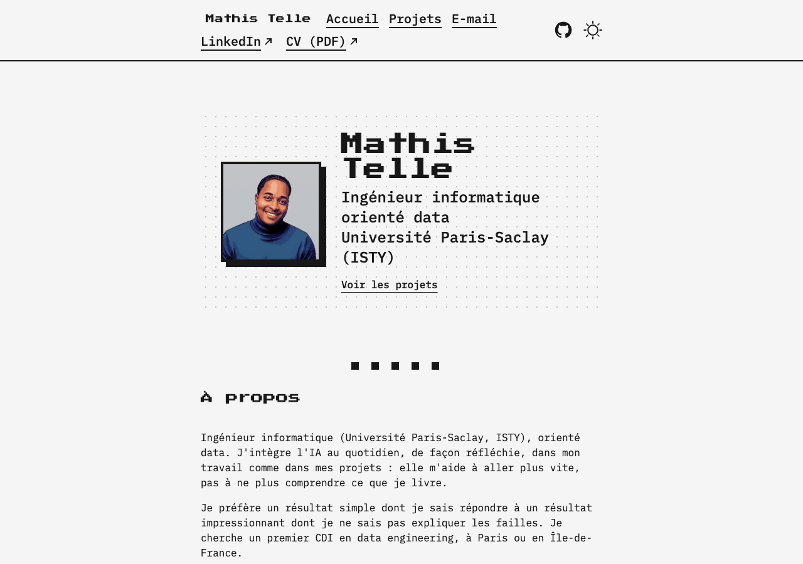
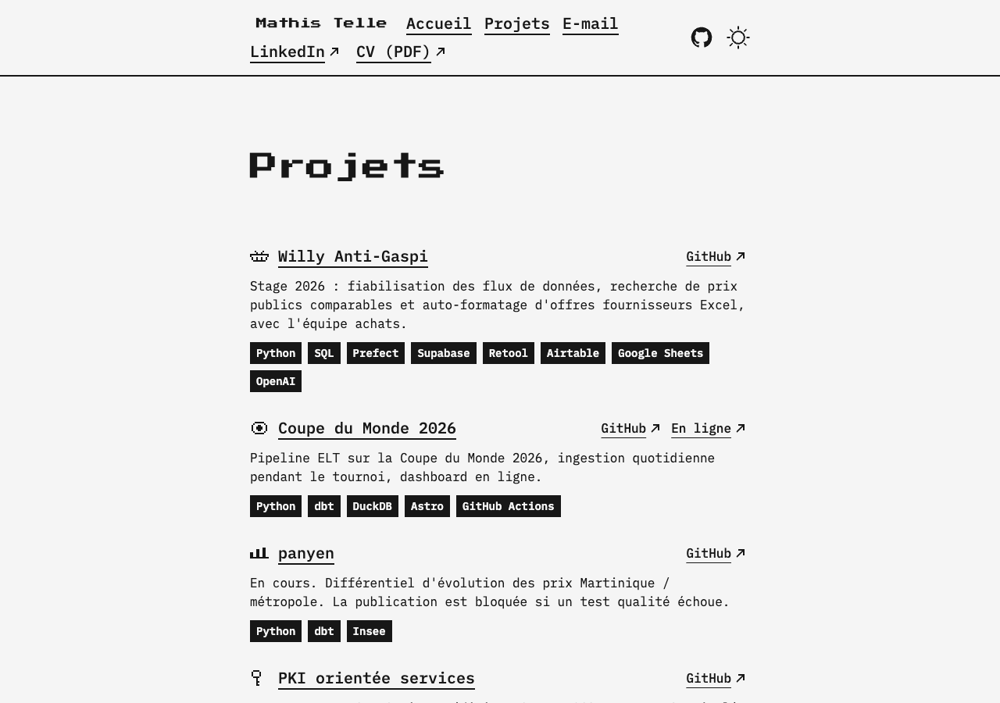

# Portfolio de Mathis Telle

[](https://github.com/mathis-tl/portfolio/actions/workflows/ci.yml)


[](LICENSE.md)

Mon portfolio : ingénieur informatique orienté data (Université Paris-Saclay, ISTY), à la recherche d'un premier CDI en data engineering à Paris ou en Île-de-France.

**En ligne : <https://portfolio-mathistelle.netlify.app>**



## Ce que contient le site

- Une page d'accueil : présentation, À propos, projets mis en avant, compétences par thème, scores de performance.
- Une page Projets avec une fiche par projet (stage Willy Anti-Gaspi, pipeline de la Coupe du Monde 2026, panyen, PKI et ITS-G5, etc.).
- Un rendu rétro volontaire : polices pixel, photo en pixel art (la vraie photo au survol), petits pictos dessinés à la main en SVG, étoiles et cadres animés en CSS.
- Mode clair et sombre.



## Choix techniques

- **Statique et léger** : Astro 7, aucun backend, aucun formulaire, aucun script tiers, aucune analytique. Les polices sont auto-hébergées (Fontsource).
- **Peu de JavaScript** : uniquement le thème clair/sombre et le menu mobile. Tous les effets visuels sont du CSS.
- **Accessibilité** : viser WCAG 2.2 AA (contrastes, navigation au clavier, focus visible, `prefers-reduced-motion` respecté, effets au survol limités aux appareils à souris).
- **Contenu séparé du code** : textes et projets dans `content/` (TOML et Markdown), validés par un schéma Zod.
- **Couleurs via des tokens** définis dans `src/styles/global.css`, jamais en dur dans les composants.

## Performances

Scores Lighthouse mesurés sur le site en ligne le 6 octobre 2026 :

| Page | Performance | Accessibilité | Bonnes pratiques | SEO |
| --- | :-: | :-: | :-: | :-: |
| Accueil, ordinateur | 100 | 100 | 100 | 100 |
| Accueil, mobile | 87 | 100 | 100 | 100 |
| Projets, ordinateur | 100 | 100 | 100 | 100 |
| Projets, mobile | 75 | 100 | 100 | 100 |

Le score de performance sur mobile est le point à surveiller : une seule mesure pour l'instant, avec la limitation de processeur que Lighthouse applique.

## Lancer le projet

Prérequis : Node.js 22 (voir `.nvmrc`) et [pnpm](https://pnpm.io/) 10.

```bash
pnpm install
pnpm dev        # serveur de développement
pnpm build      # build de production dans dist/
pnpm preview    # prévisualiser le build
pnpm lint       # Biome
pnpm check      # astro check (TypeScript)
```

## Structure

```text
content/          textes (configuration.toml) et fiches projets (Markdown)
public/           fichiers statiques (CV PDF, icônes)
src/
  assets/         images (photo, photo en pixel art)
  components/     composants Astro (accueil, en-tête, pictos pixel)
  layouts/        gabarits de page
  lib/            pictos pixel et utilitaires
  pages/          routes
  styles/         styles globaux et tokens (Tailwind 4)
```

## Déploiement

Le site est hébergé sur Netlify (`netlify.toml` : `pnpm build`, dossier `dist/`, Node 22, en-têtes de sécurité). La CI GitHub lance Biome, `astro check` et le build sur chaque PR.

## Contact

[LinkedIn](https://www.linkedin.com/in/mathis-telle-40a572260) · [GitHub](https://github.com/mathis-tl) · tellemathis@gmail.com

## Crédits et licence

Basé sur le thème [Zaggonaut](https://github.com/RATIU5/zaggonaut) de RATIU5, très adapté. Code sous licence MIT (voir [LICENSE.md](LICENSE.md)). Les textes, la photo et les contenus des projets restent ma propriété.
